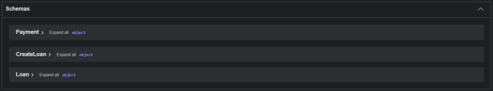

# Loan and payment application

# Purpose
Provides functionality to:
- Create a new loan with a specific loan amount and loan term
- Make payments against existing loans

HTTP endpoints are provided from where the functionality can be accessed.

An in-memory H2 Database is used for persistent storage. The database entries will be lost once the application has been shut down.

Maven is used for dependency management.

# Pre-requisites for building or running the application
- Maven
- JDK 17+ 

# Building the application

`mvn clean compile`

# Running the application
Ensure the project has been built before attempting to run it.

`mvn spring-boot:run`

# Testing the application

## Automated testing

`mvn clean test`

Jacoco has been added to test executions which adds a coverage report.
The coverage report can be viewed at the following location, after running the test command.

> ./target/site/jacoco/index.html

## Manually testing

OpenAPI and Swagger have been added to the project to ease manual testing and to publish schema definitions.

1. Run the application by issuing the build & run commands  
    `mvn clean compile && mvn spring-boot:run`
2. In a browser, navigate to the URL http://localhost:8080/swagger-ui/index.html
3. The HTTP endpoints will then be visible.

4. Click on one of the endpoints to expand it.

5. Click on the 'Try it out' button on the right-hand side.

6. There will be an editable field, which shows the schema that the endpoints accepts.
7. Once a payload has be crafted, clicking the 'Execute button' will execute the HTTP call.
8. The actual HTTP Response will now be visible in the Responses section.

9. Underneath the actual response is a section dedicated to provide all possible response codes, including the schema definition of the response.
 
10. All schema definitions are listed below the HTTP endpoints
